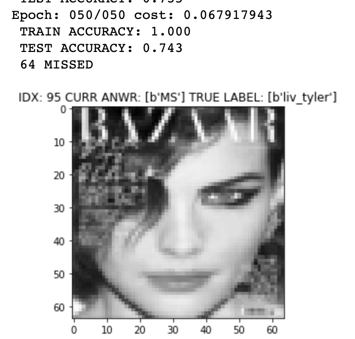
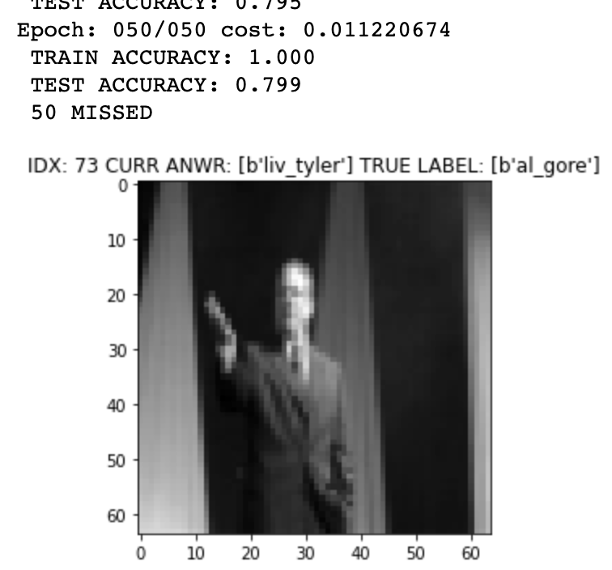
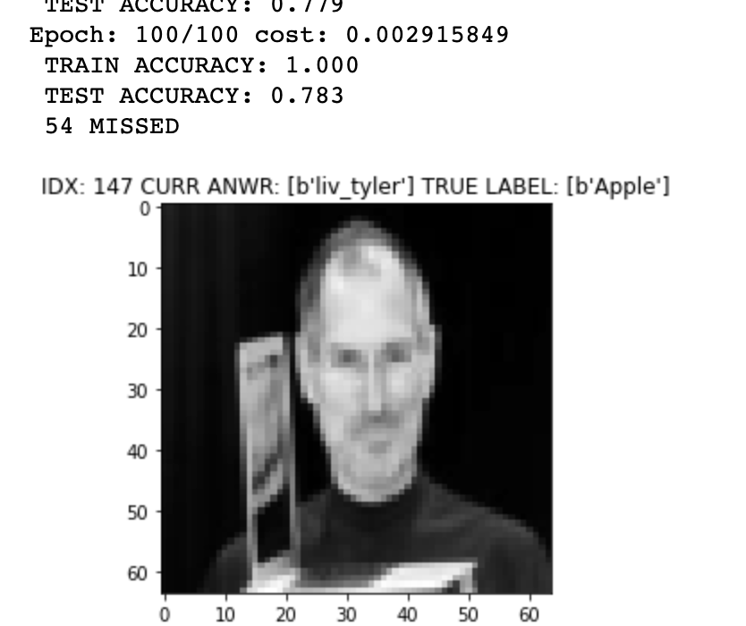
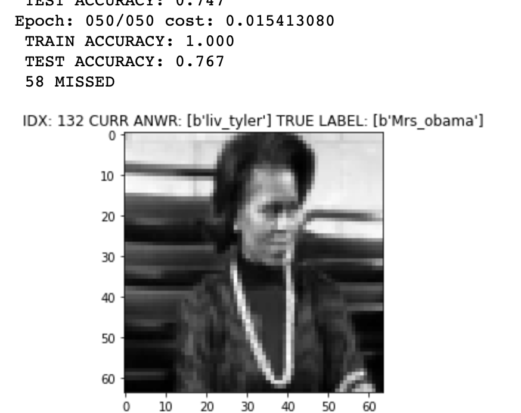
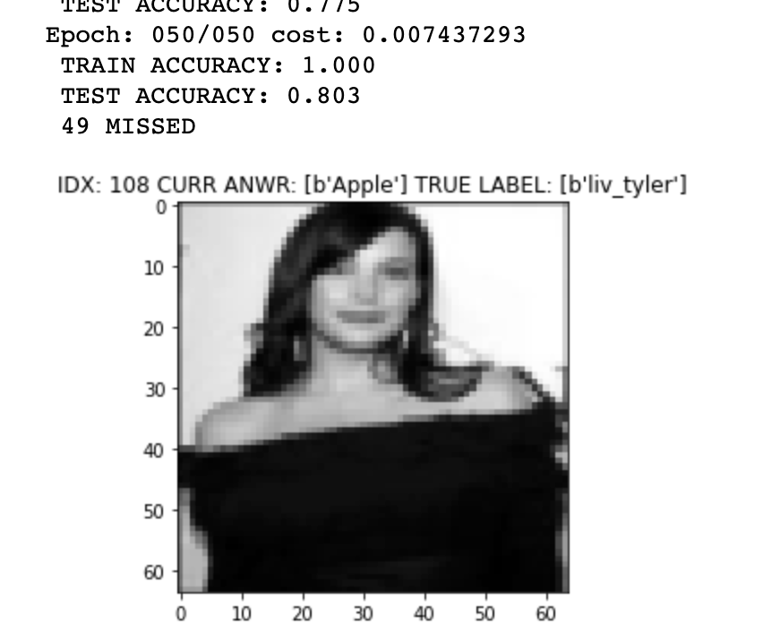
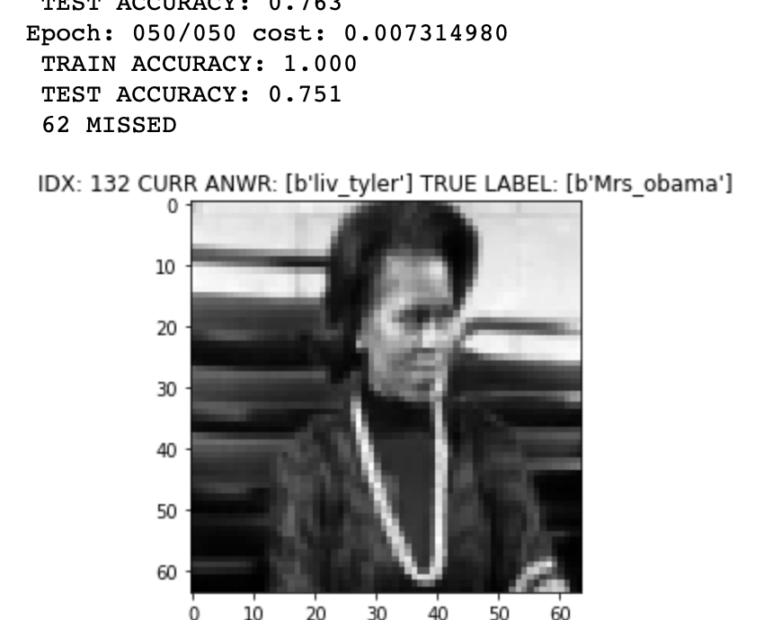
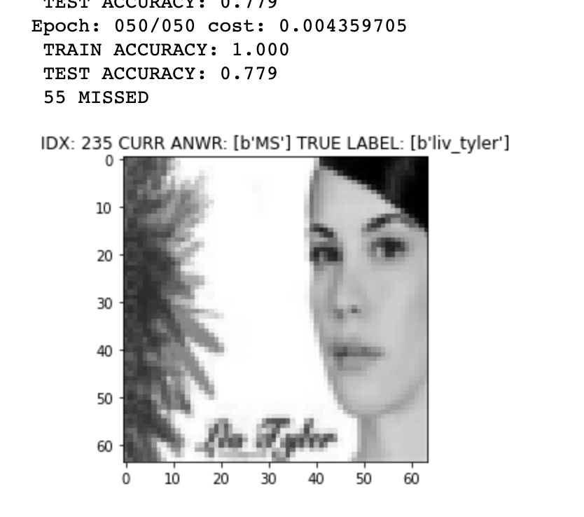

# HW01 : change configuration of the given model

## Default model - TEST ACCURACY: 0.743

## Change the number of hidden node - TEST ACCURACY: 0.799

## Train more epochs - TEST ACCURACY: 0.783

## More layers - TEST ACCURACY: 0.767

## Change activation function - TEST ACCURACY: 0.803 ; **best result**

## Add residual connection - TEST ACCURACY: 0.751

## Modify learning rate - TEST ACCURACY: 0.779

More details could be seen on this [notebook](Submission.ipynb)